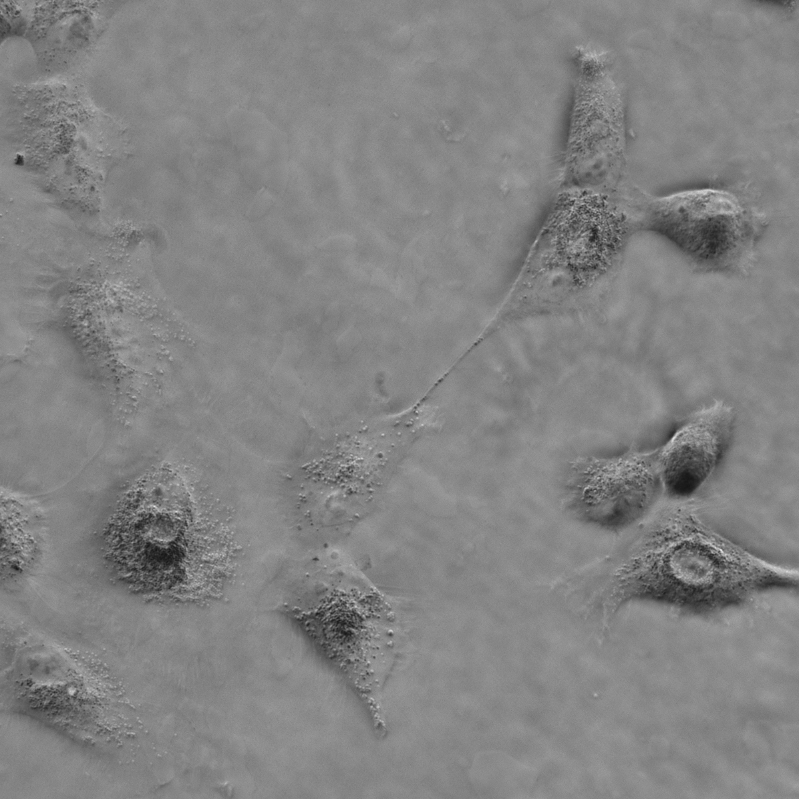
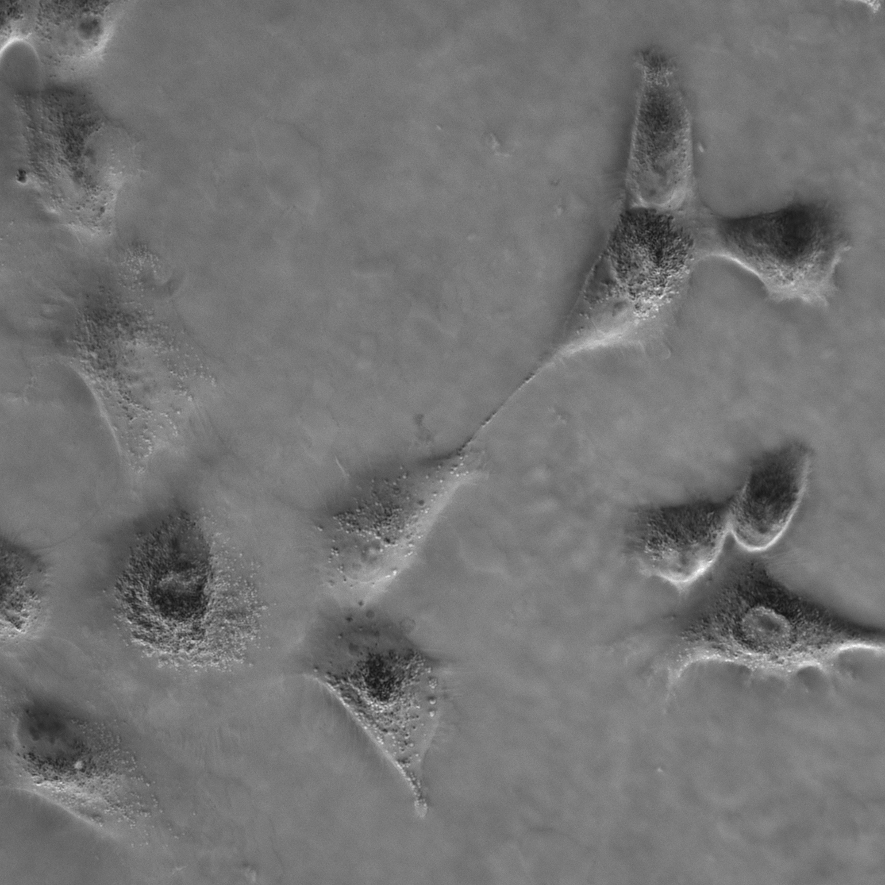
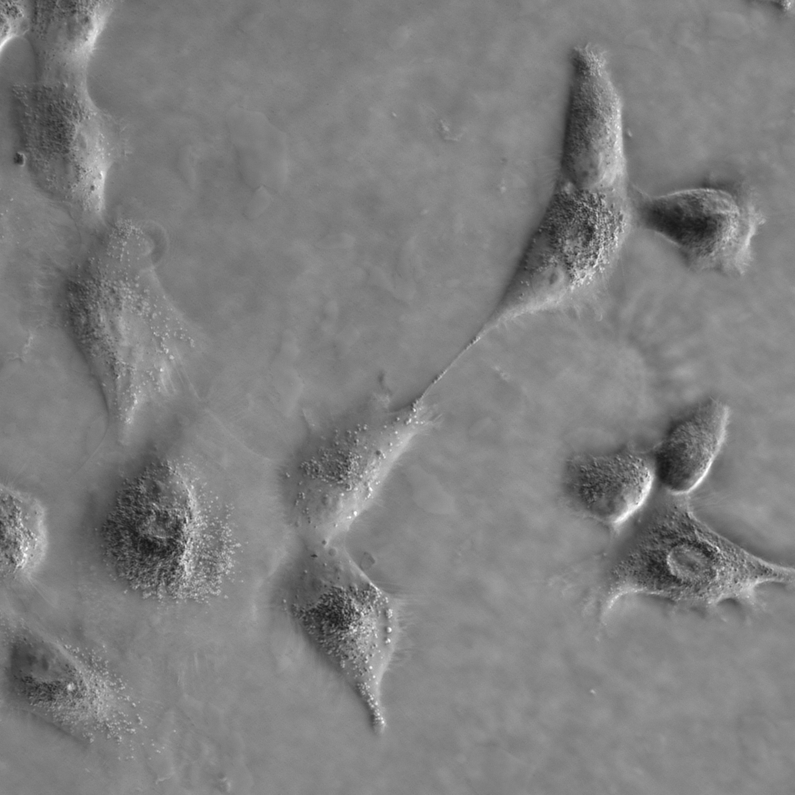
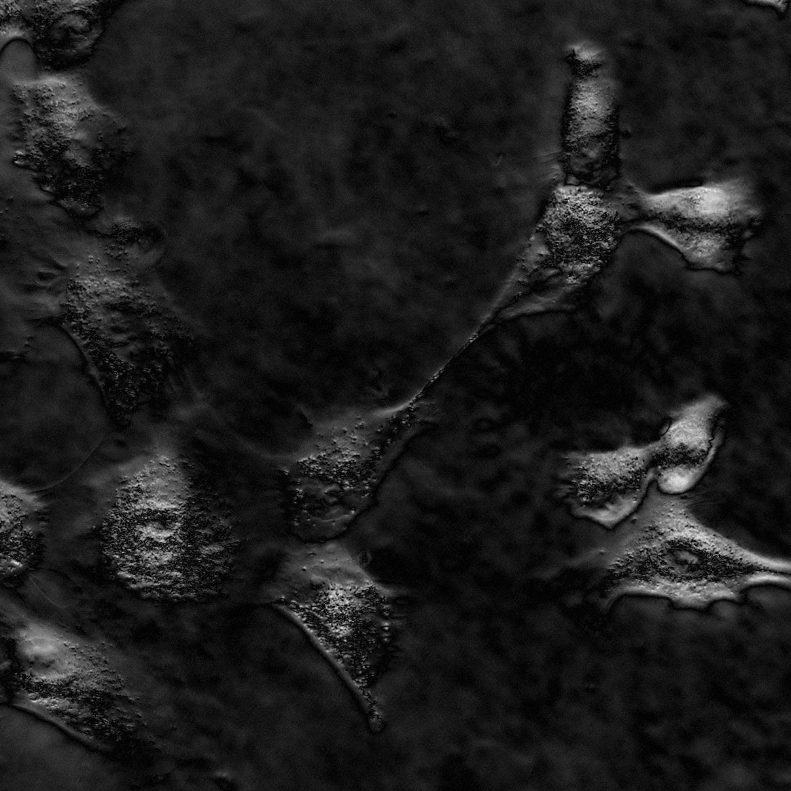
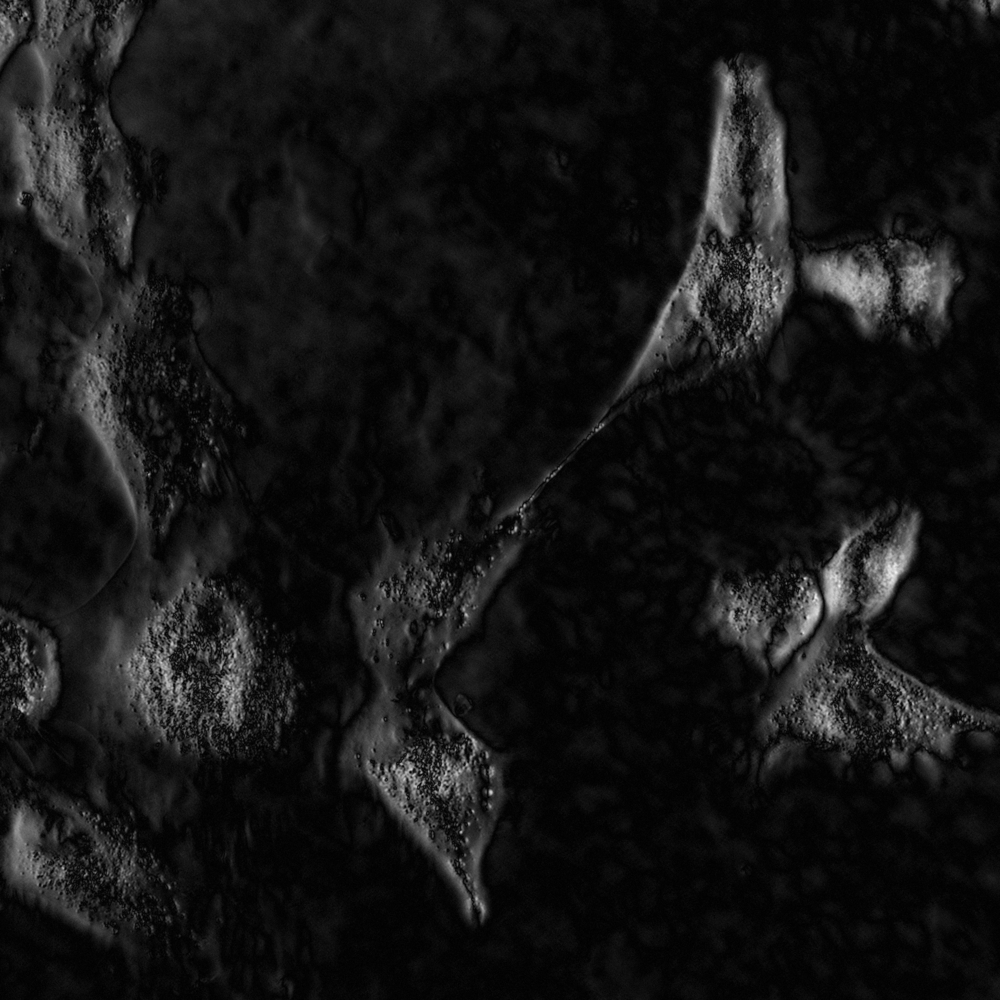
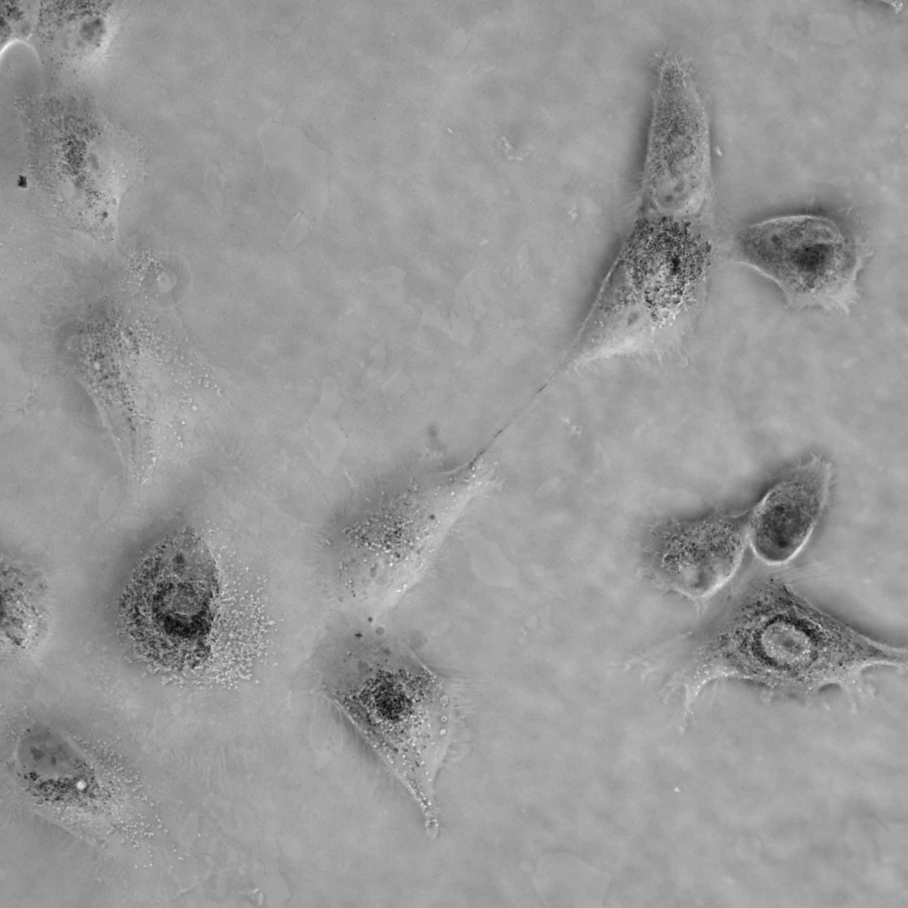
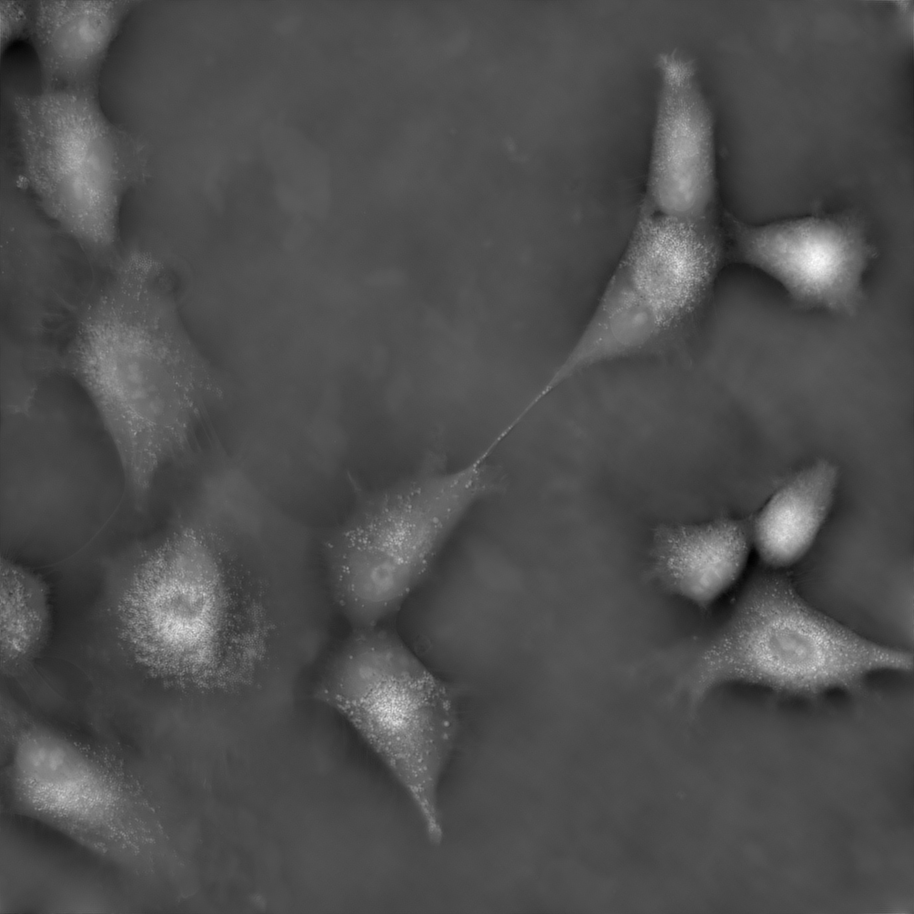
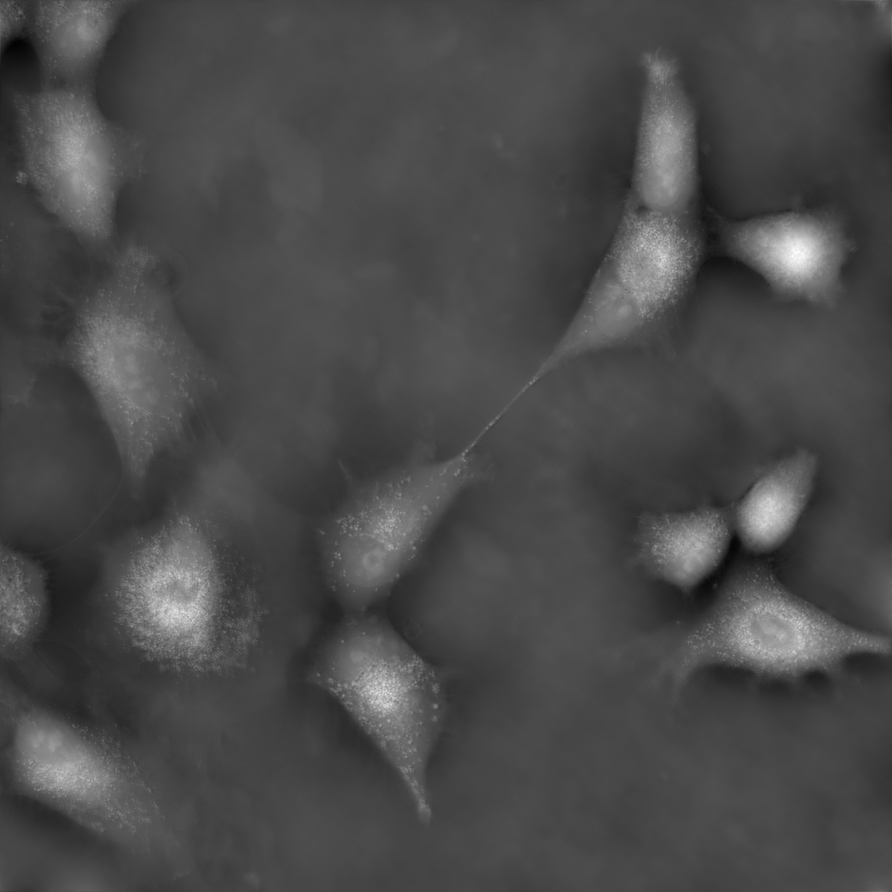
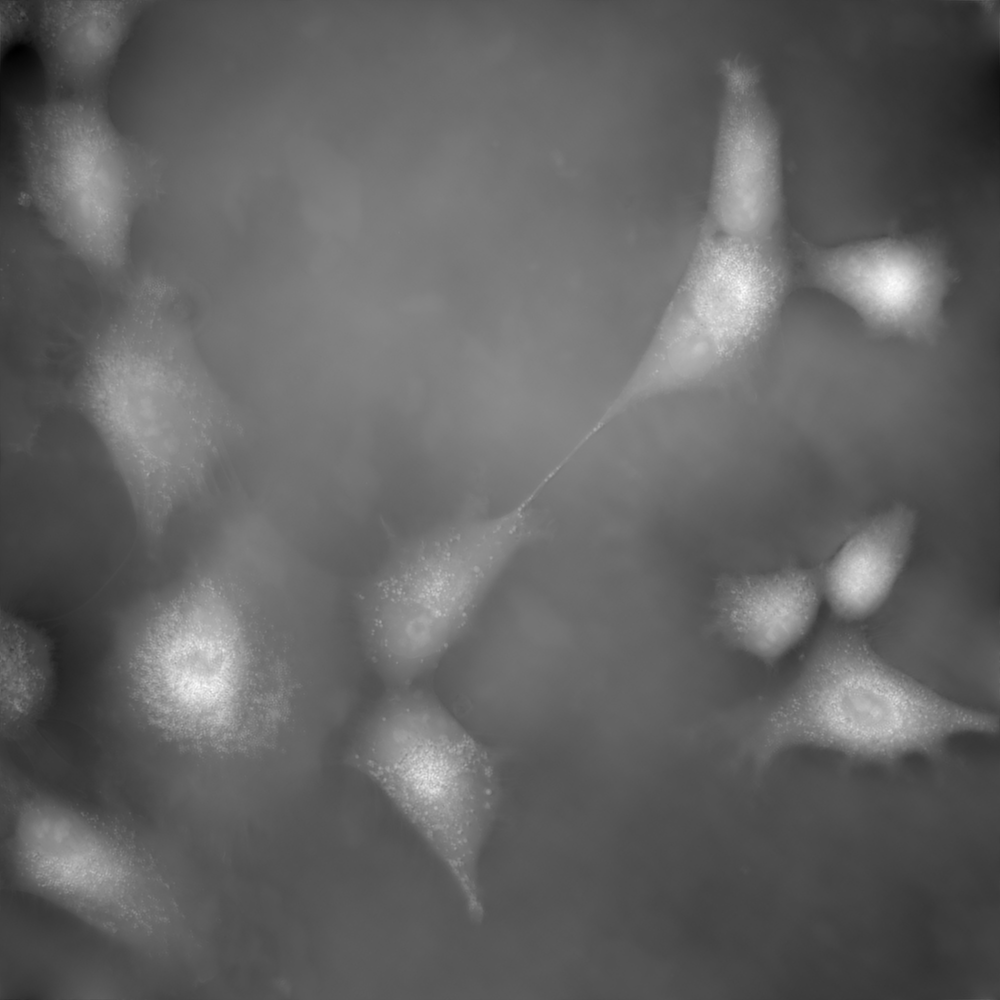
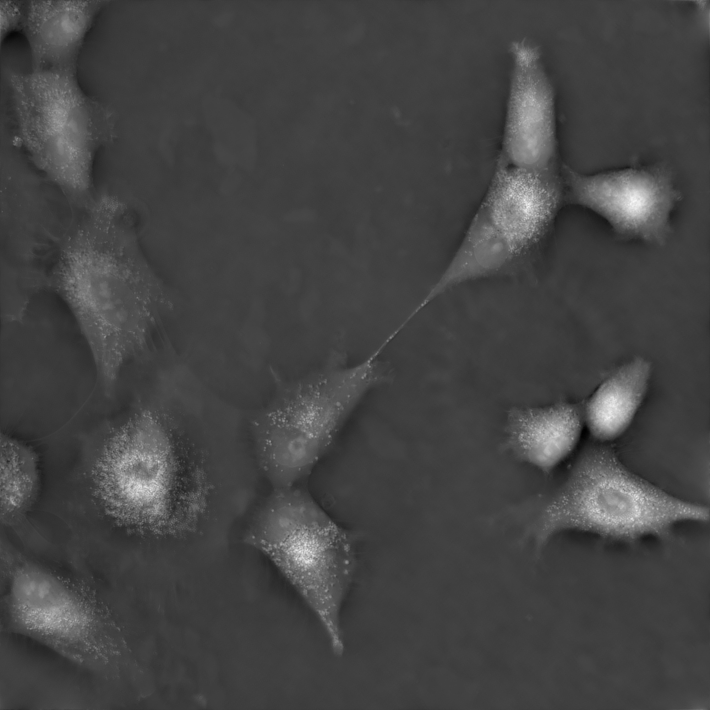

# Automated Edge Extraction and High-Clarity Phase Imaging via Pupil-Driven Differential Phase Contrast Imaging

To overcome these challenges, we propose a novel pupil-driven differential phase contrast (PD-DPC) framework that integrates the PTF information determined by the optical system into the cost function of DPC deconvolution. Although the PTF is not universally equivalent to an edge-detection filter based on its spectral characteristics and spatial response, under the asymmetric illumination used in DPC imaging, the system PTF becomes odd-symmetric and band-limited. Within its passband, the PTF exhibits a gradient-like response. This response leads to edge enhancement. Therefore, we design an edge-sparsity-promoting penalty that suppresses noise while preserving fine features. Meanwhile, the convolution is duplicated in the data fidelity term to achieve a Retinex-like filtering, enabling automatic background rectification. The PD-DPC cost function is solved using Split Bregman methods with our developed iterative reweighted soft-threshold operator. In addition, the illumination pupil can be adaptively optimized based on the edge response cost function of specific patterns. The proposed PD-DPC is hardware-agnostic and demonstrates superior robustness across diverse imaging scenarios. Extensive validation on both simulated and experimental datasets shows improved phase fidelity, edge extraction, and background suppression over state-of-the-art (SOTA) qDPC methods. The PD-DPC imaging extends beyond transparent samples, enabling high-resolution imaging of absorbing tissues, illustrating its potential for label-free pathology imaging and dynamic live-cell analysis.

[[Codes]](https://github.com/zhoujinhua2015/Pupil-Driven-Differential-Phase-Contrast)

## PD-qDPC / PD-DPC (MATLAB)

MATLAB reference implementation for **quantitative Differential Phase Contrast (qDPC)** reconstruction, including a **Pupil-Driven DPC (PD-DPC / PD-qDPC)** solver and several common baselines.

This repository contains:
- A ready-to-run demo script (`PD_DPC.m`)
- Core solvers under `func/solver/`
- A small example dataset (`rawdata/`) and example outputs (`examples/rawdata_output/`)

---

### What it does

Given **four raw DPC intensity images** captured under different asymmetric illuminations (named `r1`–`r4`), the pipeline:
1. Builds two-axis DPC measurements
2. Computes the DPC transfer functions from microscope parameters
3. Reconstructs a quantitative phase/OPD-like image using multiple reconstruction methods
4. Saves visualizations and intermediate results

Reconstruction methods included:
- **L2-qDPC** (Tikhonov / ridge)
- **Iso-qDPC** (gradient + Gaussian regularization; see Chen *et al.* 2018)
- **TV-qDPC** (total variation, Split Bregman)
- **Retinex TV-qDPC** (TV with Retinex-like gradient-domain formulation)
- **PD-qDPC (Pupil-Driven DPC)** (joint pupil-driven deconvolution with TV + sparse priors)

---

### Quick start

#### Requirements
- MATLAB (R2016b or newer recommended)
- **Image Processing Toolbox** (used by functions such as `psf2otf`, `fspecial`, `imfilter`, `imfill`, `strel`)

#### Run the demo
1. Put your data in `rawdata/` (or use the included example data):
   - `rawdata/r1.BMP`
   - `rawdata/r2.BMP`
   - `rawdata/r3.BMP`
   - `rawdata/r4.BMP`
2. In MATLAB, set the working directory to the repo root, then run:
   - Open and run `PD_DPC.m` (or type `PD_DPC` in the Command Window)
3. Results are saved to:
   - `examples/rawdata_output/`

---

### Input format (important)

The script forms two DPC channels as:
- `$I_{dpc,1} \leftarrow (r1 - r2) / ( (r1+r2+r3+r4)/2 + \varepsilon)$`
- `$I_{dpc,2} \leftarrow (r3 - r4) / ( (r1+r2+r3+r4)/2 + \varepsilon)$`

So **`r1`/`r2` must be a paired illumination (opposites)** for one axis, and **`r3`/`r4` for the orthogonal axis**.

---

### Key parameters

Microscope/system parameters live in:
- `func/init_environment.m` (e.g., wavelength `lambda`, objective NA `na_obj`, illumination NA `na_illum`, magnification `mag`, pixel size `unit`)

The main demo script (`PD_DPC.m`) controls:
- `iter`: number of iterations for iterative solvers
- `cal`: toggles which methods to run

---

### Outputs

The demo saves (in `examples/rawdata_output/`):
- `I_dpc_1.png`, `I_dpc_2.png`: computed DPC channels
- `qDPC_BF.png`: brightfield-like average image (mean of `r1`–`r4`)
- `qDPC_1_l2.png`: L2-qDPC reconstruction
- `qDPC_2_IS.png`: Iso-qDPC reconstruction
- `qDPC_3_TV.png`: TV-qDPC reconstruction
- `qDPC_4_RTV.png`: Retinex TV-qDPC reconstruction
- `qDPC_5_PD2.png`: PD-qDPC reconstruction
- `pd_DPC_edge.png`: edge/structure map from PD solver
- `alldata.mat`: MATLAB variables for reconstructions
- `parameters.txt`: regularization parameters used in this run

---

### Example results (included)

Inputs (r1–r4):

| r1 | r2 |
|---|---|
|  |  |
|  |  |

DPC channels and reconstructions:

| DPC-1 | DPC-2 | BF (avg) |
|---|---|---|
|  |  |  |

| L2-qDPC | Iso-qDPC | TV-qDPC |
|---|---|---|
|  |  |  |

| Retinex TV-qDPC | PD-qDPC | PD edge map |
|---|---|---|
|  |  |  |

---

### Project structure

- `PD_DPC.m`: main demo / entry script
- `func/`
  - `init_environment.m`: microscope/system parameters
  - `init_computation.m`: frequency grids + DPC measurements
  - `init_pupilpara.m`: transfer function construction
  - `solver/`: reconstruction solvers
  - `padding/`: optional mask-based reflected padding utilities
- `rawdata/`: example input images
- `examples/rawdata_output/`: example outputs (also default output directory)

---

### Reference

- Hsi-Hsun Chen, Yu-Zi Lin, Yuan Luo, “Isotropic differential phase contrast microscopy for quantitative phase bio-imaging,” *J. Biophotonics*, 2018. (See comment in `func/solver/solver_GradGauss_DPC.m`.)

---

### Citation

If you use this code in academic work, please cite the repository and the relevant paper/thesis.

You can start with a software citation like:

```bibtex
@software{pd_qdpc_pd_dpc,
  title  = {PD-qDPC / PD-DPC (MATLAB)},
  author = {YOUR_NAME},
  year   = {2026},
  url    = {https://github.com/YOUR_GITHUB_USERNAME/YOUR_REPO_NAME}
}
```

---

### License

No license is specified yet. **Before making the repository public**, please add a `LICENSE` file (e.g., MIT/Apache-2.0/GPL) consistent with how you want others to use and redistribute the code.

